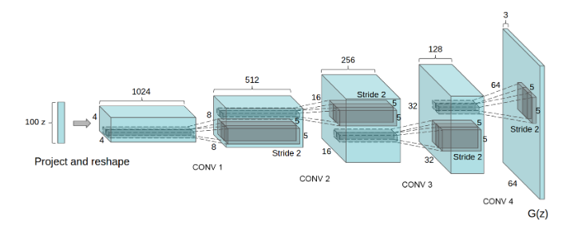
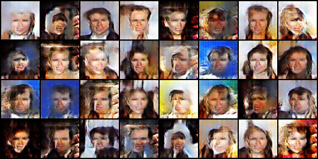
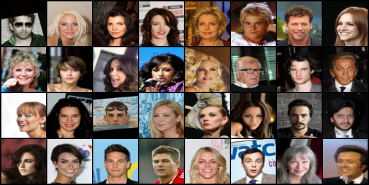

# DCGAN-pytorch
This repo is a pytorch implementation of 
[Unsupervised Representation Learning with 
Deep Convolutional Generative Adversarial 
Networks(DCGAN)](https://arxiv.org/abs/1511.06434) on [celbA dataset](https://mmlab.ie.cuhk.edu.hk/projects/CelebA.html)



GANs, also known as Generative Adversarial Networks, are one of the most fascinating new developments in deep learning.
Yann LeCun saw GANs as "the most fascinating idea in the last 10 years in ML" when Ian Goodfellow and Yoshua Bengio from the University of Montreal first unveiled them in 2014.
GANS are frequently used to make deep fake films, improve the quality of images, face swap, design gaming characters, and much more. 
# Setup and Generate
ode is developed under following library dependencies
```commandline
python 3.8
torch 1.12.0
torchvision 0.13.0
```
Start with creating a virtual environment then open your terminal and follow the following steps:
```commandline
git clone "https://github.com/zaghlol94/DCGAN-pytorch"
cd DCGAN-pytorch
pip install -r requirements.txt
bash download_assets.sh
cd src
python generate.py
```
# Dataset and Train
## Dataset
CelebFaces Attributes Dataset (CelebA) is a large-scale face attributes 
dataset with more than 200K celebrity images. 
```commandline
└── src
    └── celeb_dataset
        └── images
            ├── 000001.jpg
            ├── 000002.jpg
            ├── 000003.jpg
            ├── .
            ├── .
            ├── .
            ├── .                        
            └── 200000.jpg
```
## Training
Download celabA dataset and add the images' folder in ```src/celb_dataset```
if you rename the root folder of the dataset don't forget to change the ````training_root_folder````
variable in [config.py](https://github.com/zaghlol94/GAN-MNIST/blob/main/src/config.py)
```commandline
cd src
python train.py
```
after training, you could see the results of fake images in every step in tensorboard
```
tensorboard --logdir=logs/ 
```
# Results
## Results after 5 epochs:
### Fake


### Real


# Citation
```commandline
@misc{https://doi.org/10.48550/arxiv.1511.06434,
  doi = {10.48550/ARXIV.1511.06434},
  
  url = {https://arxiv.org/abs/1511.06434},
  
  author = {Radford, Alec and Metz, Luke and Chintala, Soumith},
  
  keywords = {Machine Learning (cs.LG), Computer Vision and Pattern Recognition (cs.CV), FOS: Computer and information sciences, FOS: Computer and information sciences},
  
  title = {Unsupervised Representation Learning with Deep Convolutional Generative Adversarial Networks},
  
  publisher = {arXiv},
  
  year = {2015},
  
  copyright = {arXiv.org perpetual, non-exclusive license}
}

```
